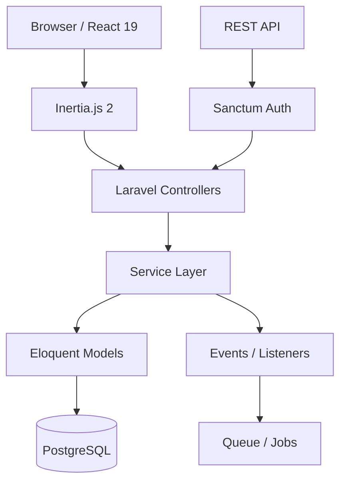

# InvoPilot

[](https://github.com/mer-prog/invopilot/actions/workflows/ci.yml)

A multi-tenant invoice SaaS application built with Laravel 12, Inertia.js 2, and React 19.


<!-- Add screenshots after deployment -->

## Tech Stack

| Layer | Technology |
|-------|-----------|
| Backend | PHP 8.5, Laravel 12, Laravel Sanctum |
| Frontend | React 19, TypeScript, Inertia.js 2, Tailwind CSS 4, shadcn/ui |
| Database | PostgreSQL 17 (Neon) / SQLite |
| PDF | barryvdh/laravel-dompdf |
| Charts | recharts |
| Testing | Pest 4 |
| CI/CD | GitHub Actions |
| Deploy | Docker, Render.com |

## Features

- **Dashboard** — Revenue stats, monthly chart (recharts), recent activity feed, overdue alerts
- **Client Management** — Full CRUD with organization scoping
- **Invoice Management** — Create, edit, send, duplicate, cancel with live preview
- **Payment Recording** — Partial/full payments with automatic status updates
- **PDF Generation** — A4 invoice PDF download with dompdf
- **Email Notifications** — Invoice sent, payment receipt, overdue reminders
- **Recurring Invoices** — Weekly/biweekly/monthly/quarterly/yearly auto-generation
- **Organization Settings** — Company info, invoice defaults, currency configuration
- **API Tokens** — Sanctum-based personal access tokens
- **REST API** — Full CRUD for clients and invoices with Bearer token auth
- **i18n** — Japanese/English with runtime toggle
- **Two-Factor Auth** — TOTP via Laravel Fortify
- **Dark Mode** — System/light/dark appearance toggle

## Architecture



## Local Development

```bash
# Clone
git clone https://github.com/mer-prog/invopilot.git
cd invopilot

# Backend
cp .env.example .env
composer install
php artisan key:generate
php artisan migrate --seed

# Frontend
npm install
npm run dev

# Start server
php artisan serve
```

Visit `http://localhost:8000`

## API Overview

All API endpoints require Sanctum Bearer token authentication.

```
Authorization: Bearer <token>
```

| Method | Endpoint | Description |
|--------|----------|-------------|
| GET | `/api/clients` | List clients |
| POST | `/api/clients` | Create client |
| GET | `/api/clients/{id}` | Show client |
| PUT | `/api/clients/{id}` | Update client |
| DELETE | `/api/clients/{id}` | Delete client |
| GET | `/api/invoices` | List invoices |
| POST | `/api/invoices` | Create invoice |
| GET | `/api/invoices/{id}` | Show invoice |
| PUT | `/api/invoices/{id}` | Update invoice |
| DELETE | `/api/invoices/{id}` | Delete invoice |

Generate tokens via Settings > API Tokens.

## Testing

```bash
php artisan test --compact
```

127+ tests covering controllers, services, policies, events, PDF generation, email notifications, and API endpoints.

## Deployment

### Docker

```bash
docker build -t invopilot .
docker run -p 8080:8080 invopilot
```

### Render.com

Deploy via `render.yaml` — web service with Docker runtime (Singapore region, free plan).

## License

MIT
