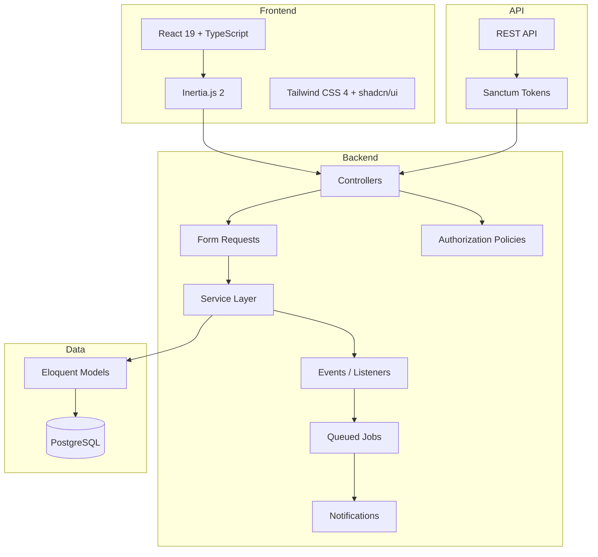

# InvoPilot — Portfolio Case Study

## Project Overview

InvoPilot is a production-ready, multi-tenant invoice SaaS application. It provides full invoicing workflows — from client management and invoice creation to payment recording, PDF generation, and automated recurring billing. Built as a solo full-stack project to demonstrate end-to-end Laravel + React proficiency.

**Live Demo:** [https://invopilot.onrender.com](https://invopilot.onrender.com) <!-- Replace with actual URL -->

**Source Code:** [https://github.com/mer-prog/invopilot](https://github.com/mer-prog/invopilot)

## Tech Stack

| Category | Technologies |
|----------|-------------|
| **Backend** | PHP 8.5, Laravel 12, Laravel Sanctum, Laravel Fortify |
| **Frontend** | React 19, TypeScript (strict), Inertia.js 2, Tailwind CSS 4, shadcn/ui |
| **Database** | PostgreSQL 17 (Neon serverless) |
| **PDF** | barryvdh/laravel-dompdf |
| **Charts** | recharts |
| **Testing** | Pest 4 (127+ tests) |
| **CI/CD** | GitHub Actions (tests + linting) |
| **Deploy** | Docker multi-stage build, Render.com |
| **i18n** | Japanese / English (runtime toggle) |

## Architecture

Inertia.js monolith — no separate API frontend. Controllers render React pages via `Inertia::render()`. Service layer handles business logic. Events/Listeners for side effects. Jobs for async processing.



## Key Features

### Dashboard
- Revenue KPIs with month-over-month growth rate
- 12-month revenue AreaChart (recharts + shadcn/ui Chart)
- Recent activity feed from event-driven activity logs
- Overdue invoice alert banner

### Client Management
- Full CRUD with organization-scoped data isolation
- Invoice history and total revenue per client
- Search and pagination

### Invoice Workflow
- Create with dynamic line items (add/remove/reorder)
- Live preview of subtotal, tax, discount, total
- Status lifecycle: Draft → Sent → Paid / Overdue / Cancelled
- Duplicate existing invoices
- PDF download (A4 layout, i18n-aware)
- Email delivery with PDF attachment

### Payment Recording
- Partial and full payments with method tracking
- Automatic status update when fully paid (via Event/Listener)
- Payment receipt notification to client

### Recurring Invoices
- Configurable frequency: weekly, biweekly, monthly, quarterly, yearly
- Automatic invoice generation via scheduled command
- Active/inactive toggle, end date support

### Settings & API
- Organization profile (name, address, phone, tax ID, logo)
- Invoice defaults (currency, prefix, payment terms, notes)
- API token management (Sanctum Personal Access Tokens)
- Full REST API for clients and invoices

### Authentication & Security
- Registration, login, email verification
- Two-factor authentication (TOTP)
- Organization-scoped authorization policies
- CSRF, session-based auth (web), Bearer token auth (API)

## Database Schema

10 tables with proper foreign keys and indexes:

| Table | Purpose |
|-------|---------|
| `users` | User accounts with locale/timezone |
| `organizations` | Multi-tenant company entities |
| `organization_user` | Pivot with role (owner/admin/member) |
| `clients` | Customer records per organization |
| `invoices` | Invoice headers with status enum |
| `invoice_items` | Line items with qty/price/tax |
| `payments` | Payment records with method enum |
| `recurring_invoices` | Recurring billing templates (JSON items) |
| `activity_logs` | Audit trail from events |
| `personal_access_tokens` | Sanctum API tokens |

## API Endpoints

```
Authorization: Bearer <token>

GET    /api/clients          List clients (paginated)
POST   /api/clients          Create client
GET    /api/clients/{id}     Show client
PUT    /api/clients/{id}     Update client
DELETE /api/clients/{id}     Delete client

GET    /api/invoices          List invoices (paginated, filterable by status)
POST   /api/invoices          Create invoice with items
GET    /api/invoices/{id}     Show invoice with client and items
PUT    /api/invoices/{id}     Update invoice
DELETE /api/invoices/{id}     Delete invoice
```

## Project Structure

```
app/
├── Console/Commands/        Artisan commands (overdue check, recurring processing)
├── Enums/                   InvoiceStatus, PaymentMethod, Frequency, Currency, Role
├── Events/                  InvoiceCreated, InvoiceSent, PaymentRecorded, InvoiceOverdue
├── Http/
│   ├── Controllers/         Web + API controllers
│   ├── Middleware/           Org context, locale, Inertia
│   ├── Requests/            Form request validation
│   └── Resources/           API JSON resources
├── Jobs/                    SendInvoiceEmail, GenerateInvoicePdf
├── Listeners/               LogActivity, UpdateInvoiceStatus, SendPaymentReceipt
├── Models/                  User, Organization, Client, Invoice, Payment, etc.
├── Notifications/           Invoice sent, payment receipt, overdue reminder
├── Policies/                Organization-scoped authorization
└── Services/                DashboardService, InvoiceService, PdfService, RecurringInvoiceService

resources/js/
├── pages/                   React pages (Inertia)
├── components/              shadcn/ui + custom components
├── hooks/                   useTrans, useCurrentUrl
├── layouts/                 AppLayout, SettingsLayout
├── lib/                     formatters (Intl API)
└── types/                   TypeScript type definitions

tests/Feature/               127+ Pest tests
lang/{en,ja}/                Translation files
```

## Testing Strategy

- **127+ tests** using Pest 4 with `RefreshDatabase`
- Feature tests for all controllers (CRUD, authorization, edge cases)
- Policy tests for organization-scoped access control
- Event/Listener integration tests
- PDF generation and email notification tests (with mocks)
- API endpoint tests with Sanctum token auth
- Overdue detection and recurring invoice generation tests

```bash
php artisan test --compact
# 127+ passed (450+ assertions)
```

## Lessons Learned

1. **Inertia.js v2 + React 19** — Server-side routing with client-side rendering eliminates API boilerplate while keeping React's component model. The `useForm` hook and `<Form>` component provide excellent DX for form handling.

2. **Event-Driven Architecture** — Using Events/Listeners for side effects (activity logging, status updates, notifications) keeps the service layer focused on core business logic and makes the system easily extensible.

3. **Multi-Tenant Data Isolation** — Organization-scoped policies and `forOrganization()` query scopes ensure data isolation at both the authorization and query layers, which is critical for SaaS applications.

4. **Sanctum Dual Auth** — Session-based auth for the web UI and token-based auth for the API, using the same controllers with Eloquent API Resources for JSON serialization.

5. **i18n from Day One** — Building with `useTrans()` hook and PHP translation files from the start avoids costly retrofitting. The Intl API handles currency/date formatting per locale automatically.
