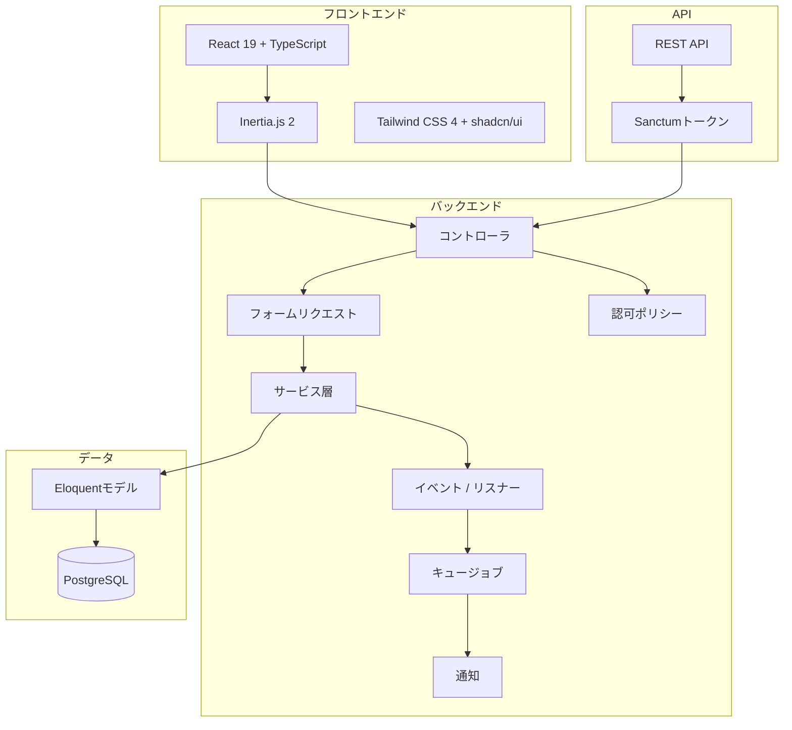

# InvoPilot — ポートフォリオ

## プロジェクト概要

InvoPilotは、マルチテナント対応の請求書SaaSアプリケーションです。顧客管理、請求書作成、入金記録、PDF生成、自動定期請求まで、請求業務の全ワークフローを提供します。Laravel + Reactのフルスタック開発力を示すソロプロジェクトとして構築しました。

**ライブデモ:** [https://invopilot.onrender.com](https://invopilot.onrender.com) <!-- 実際のURLに置換 -->

**ソースコード:** [https://github.com/mer-prog/invopilot](https://github.com/mer-prog/invopilot)

## 技術スタック

| カテゴリ | 技術 |
|---------|------|
| **バックエンド** | PHP 8.5, Laravel 12, Laravel Sanctum, Laravel Fortify |
| **フロントエンド** | React 19, TypeScript (strict), Inertia.js 2, Tailwind CSS 4, shadcn/ui |
| **データベース** | PostgreSQL 17 (Neon serverless) |
| **PDF** | barryvdh/laravel-dompdf |
| **チャート** | recharts |
| **テスト** | Pest 4 (127テスト以上) |
| **CI/CD** | GitHub Actions (テスト + リント) |
| **デプロイ** | Docker マルチステージビルド, Render.com |
| **i18n** | 日本語 / 英語 (ランタイム切替) |

## アーキテクチャ

Inertia.js モノリス構成。コントローラが `Inertia::render()` でReactページを描画。Service層にビジネスロジック。Events/Listenersで副作用処理。Jobsで非同期処理。



## 主要機能

### ダッシュボード
- 売上KPI（前月比成長率付き）
- 12ヶ月売上推移グラフ（recharts + shadcn/ui Chart）
- イベント駆動のアクティビティフィード
- 期限切れ請求書アラート

### 顧客管理
- 組織スコープによるデータ分離付きフルCRUD
- 顧客別の請求履歴と合計売上
- 検索とページネーション

### 請求書ワークフロー
- 動的な明細行（追加/削除/並替）で作成
- 小計・税・割引・合計のライブプレビュー
- ステータスライフサイクル: 下書き → 送信済 → 支払済 / 期限切れ / キャンセル
- 既存請求書の複製
- PDFダウンロード（A4レイアウト、i18n対応）
- PDF添付メール送信

### 入金記録
- 部分入金・全額入金（支払方法追跡付き）
- 全額入金時の自動ステータス更新（Event/Listener経由）
- 顧客への入金確認通知

### 定期請求書
- 設定可能な頻度: 毎週、隔週、毎月、四半期、毎年
- スケジュールコマンドによる自動請求書生成
- 有効/無効切替、終了日サポート

### 設定 & API
- 組織プロフィール（名前、住所、電話、税ID、ロゴ）
- 請求書デフォルト（通貨、プレフィックス、支払条件、備考）
- APIトークン管理（Sanctum Personal Access Tokens）
- クライアント・請求書のフルREST API

### 認証 & セキュリティ
- ユーザー登録、ログイン、メール確認
- 二要素認証（TOTP）
- 組織スコープの認可ポリシー
- CSRF、セッション認証（Web）、Bearerトークン認証（API）

## データベーススキーマ

外部キーとインデックス付きの10テーブル:

| テーブル | 用途 |
|---------|------|
| `users` | ロケール/タイムゾーン付きユーザーアカウント |
| `organizations` | マルチテナント組織エンティティ |
| `organization_user` | ロール付きピボット（owner/admin/member） |
| `clients` | 組織ごとの顧客レコード |
| `invoices` | ステータスenum付き請求書ヘッダ |
| `invoice_items` | 数量/単価/税率付き明細行 |
| `payments` | 支払方法enum付き入金レコード |
| `recurring_invoices` | 定期請求テンプレート（JSON明細） |
| `activity_logs` | イベント駆動の監査証跡 |
| `personal_access_tokens` | Sanctum APIトークン |

## APIエンドポイント

```
Authorization: Bearer <token>

GET    /api/clients          顧客一覧（ページネーション付き）
POST   /api/clients          顧客作成
GET    /api/clients/{id}     顧客詳細
PUT    /api/clients/{id}     顧客更新
DELETE /api/clients/{id}     顧客削除

GET    /api/invoices          請求書一覧（ページネーション、ステータスフィルタ対応）
POST   /api/invoices          明細付き請求書作成
GET    /api/invoices/{id}     請求書詳細（顧客・明細含む）
PUT    /api/invoices/{id}     請求書更新
DELETE /api/invoices/{id}     請求書削除
```

## プロジェクト構成

```
app/
├── Console/Commands/        Artisanコマンド（期限切れチェック、定期処理）
├── Enums/                   InvoiceStatus, PaymentMethod, Frequency, Currency, Role
├── Events/                  InvoiceCreated, InvoiceSent, PaymentRecorded, InvoiceOverdue
├── Http/
│   ├── Controllers/         Web + APIコントローラ
│   ├── Middleware/           組織コンテキスト、ロケール、Inertia
│   ├── Requests/            フォームリクエストバリデーション
│   └── Resources/           API JSONリソース
├── Jobs/                    SendInvoiceEmail, GenerateInvoicePdf
├── Listeners/               LogActivity, UpdateInvoiceStatus, SendPaymentReceipt
├── Models/                  User, Organization, Client, Invoice, Payment 等
├── Notifications/           請求書送信、入金確認、期限切れリマインダー
├── Policies/                組織スコープ認可
└── Services/                DashboardService, InvoiceService, PdfService, RecurringInvoiceService

resources/js/
├── pages/                   Reactページ（Inertia）
├── components/              shadcn/ui + カスタムコンポーネント
├── hooks/                   useTrans, useCurrentUrl
├── layouts/                 AppLayout, SettingsLayout
├── lib/                     フォーマッター（Intl API）
└── types/                   TypeScript型定義

tests/Feature/               127以上のPestテスト
lang/{en,ja}/                翻訳ファイル
```

## テスト戦略

- **127テスト以上** — Pest 4 + `RefreshDatabase`
- 全コントローラのフィーチャーテスト（CRUD、認可、エッジケース）
- 組織スコープアクセス制御のポリシーテスト
- Event/Listener統合テスト
- PDF生成・メール通知テスト（モック使用）
- Sanctumトークン認証によるAPIエンドポイントテスト
- 期限切れ検知・定期請求書生成テスト

```bash
php artisan test --compact
# 127+ passed (450+ assertions)
```

## 学んだこと

1. **Inertia.js v2 + React 19** — サーバーサイドルーティングとクライアントサイドレンダリングの組み合わせにより、APIボイラープレートを排除しながらReactのコンポーネントモデルを活用。`useForm`フックと`<Form>`コンポーネントによるフォーム処理のDXが優秀。

2. **イベント駆動アーキテクチャ** — Events/Listenersで副作用（アクティビティログ、ステータス更新、通知）を処理することで、サービス層をコアビジネスロジックに集中させ、拡張性を確保。

3. **マルチテナントデータ分離** — 組織スコープのポリシーと`forOrganization()`クエリスコープにより、認可層とクエリ層の両方でデータ分離を実現。SaaSアプリケーションに不可欠。

4. **Sanctumデュアル認証** — Web UIにはセッション認証、APIにはトークン認証を同一コントローラで提供。Eloquent API Resourcesで JSON シリアライズ。

5. **初日からのi18n** — `useTrans()`フックとPHP翻訳ファイルを最初から導入することで、後からの大規模な改修を回避。Intl APIが通貨・日付フォーマットをロケールごとに自動処理。
